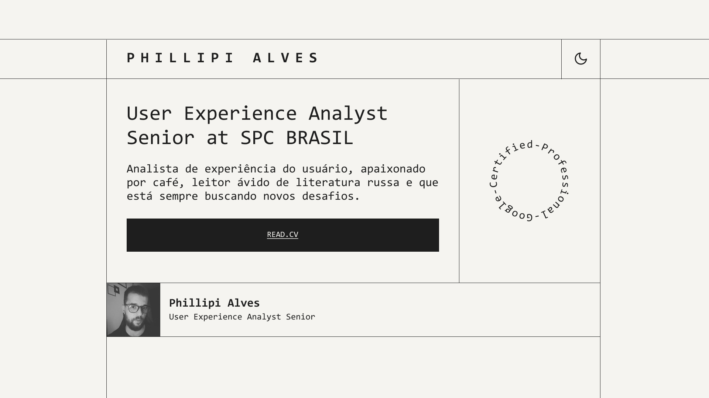

## Portfolio

## Stacks

- SCSS
- TypeScript

## Libs

- Styled Components

## UI Style - Brutalism

### History

O brutalismo é um estilo arquitetônico que surgiu na Europa após a Segunda Guerra Mundial e atingiu seu apogeu nas décadas de 1950 e 1960. Seu nome vem do francês “béton brut”, que significa concreto bruto – expressão que complementa perfeitamente as ideias e características desse estilo.

### Design
O brutalismo no design é caracterizado por sua aparência crua e experimentalismo. Este é um estilo inconformista que se rebela contra as tendências de design estabelecidas. 

